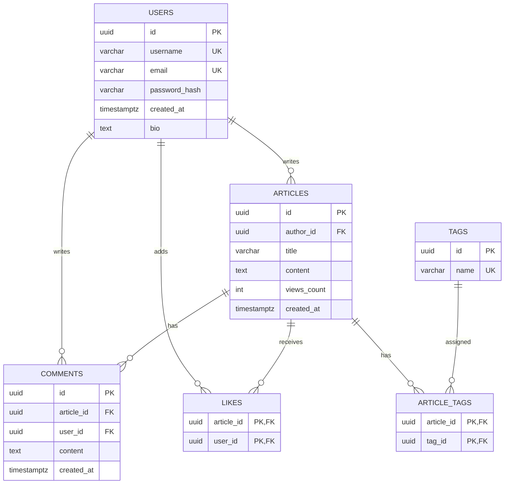

# Blog Backend

[](https://github.com/lya122221/Blog-Backend/actions/workflows/ci.yml)

REST API для IT-блога на Go. Приложение поддерживает регистрацию и
JWT-аутентификацию, публикацию статей с тегами, комментарии, лайки и отложенный
подсчёт просмотров через Redis.

## Возможности

- регистрация и вход по email и паролю;
- JWT-аутентификация с алгоритмом HS256;
- создание, чтение, обновление и удаление статей;
- проверка авторства при обновлении и удалении статьи;
- теги, фильтрация и пагинация;
- комментарии к статьям;
- установка и снятие лайка одним endpoint;
- буферизация просмотров в Redis и перенос в PostgreSQL фоновым worker;
- структурированные JSON- или text-логи с request ID;
- graceful shutdown HTTP-сервера и фонового worker;
- тесты, race detector, линтеры и контроль покрытия в GitHub Actions;
- публикация Docker-образов в GitHub Container Registry.

## Технологии

| Назначение | Технология |
|---|---|
| Язык | Go 1.25 |
| HTTP | Gin |
| База данных | PostgreSQL 15 |
| Драйвер PostgreSQL | pgx через `database/sql` |
| Кэш и просмотры | Redis 7 |
| Аутентификация | JWT HS256 и bcrypt |
| Миграции | golang-migrate |
| Логирование | `log/slog` |
| Контейнеры | Docker и Docker Compose |
| CI/CD | GitHub Actions и GHCR |

## Архитектура

```text
Blog-Backend/
├── cmd/blog/                 # Точка входа, HTTP-сервер и graceful shutdown
├── internal/
│   ├── handlers/             # HTTP-обработчики Gin
│   ├── logger/               # Настройка slog
│   ├── middleware/           # JWT, access logs и panic recovery
│   ├── models/               # API- и доменные структуры
│   ├── repositories/         # PostgreSQL и Redis
│   ├── services/             # Бизнес-логика
│   └── workers/              # Перенос просмотров из Redis в PostgreSQL
├── migrations/               # SQL-миграции
├── pkg/                      # JWT-утилиты
├── .github/workflows/ci.yml  # CI и публикация Docker-образа
├── .golangci.yml             # Конфигурация линтеров
├── Dockerfile
└── docker-compose.yml
```

Зависимости направлены от HTTP-обработчиков к сервисам, а от сервисов — к
интерфейсам репозиториев. Благодаря этому сервисы и handlers тестируются без
запуска PostgreSQL и Redis.

### Подсчёт просмотров

При получении статьи счётчик увеличивается в Redis. Раз в три минуты worker
забирает накопленные значения и добавляет их к `articles.views_count` в
PostgreSQL. Это уменьшает количество записей в основную базу данных.

## Схема данных



## Быстрый запуск

### Требования

- Docker;
- Docker Compose v2.

### 1. Клонирование

```bash
git clone https://github.com/lya122221/Blog-Backend.git
cd Blog-Backend
```

### 2. Конфигурация

Создайте `.env` в корне проекта:

```env
POSTGRES_USER=blog
POSTGRES_PASSWORD=change_me
POSTGRES_DB=blog
JWTKEY=replace_with_a_long_random_secret
LOG_LEVEL=info
LOG_FORMAT=json
```

Для генерации JWT-ключа можно использовать:

```bash
openssl rand -hex 32
```

Не добавляйте `.env` в Git.

### 3. Запуск

```bash
docker compose up --build
```

Compose запустит PostgreSQL, Redis, применит миграции и поднимет API на
`http://localhost:8080`.

Посмотреть логи:

```bash
docker compose logs -f api
```

Остановить приложение:

```bash
docker compose down --timeout 20
```

Таймаут в 20 секунд оставляет приложению время на graceful shutdown. Данные
PostgreSQL сохраняются в volume `postgres_data`.

## Переменные окружения

| Переменная | Обязательная | Значение по умолчанию | Описание |
|---|---:|---|---|
| `POSTGRES_USER` | да | — | Пользователь PostgreSQL |
| `POSTGRES_PASSWORD` | да | — | Пароль PostgreSQL |
| `POSTGRES_DB` | да | — | Имя базы данных |
| `POSTGRES_HOST` | нет | `localhost` | Хост PostgreSQL; в Compose используется `db` |
| `REDIS_HOST` | нет | `localhost` | Хост Redis; в Compose используется `redis` |
| `JWTKEY` | да | — | Секрет подписи JWT |
| `LOG_LEVEL` | нет | `info` | `debug`, `info`, `warn` или `error` |
| `LOG_FORMAT` | нет | `json` | `json` или `text` |

Порты PostgreSQL, Redis и API сейчас заданы в конфигурации как `5432`,
`6379` и `8080`.

## API

Базовый URL:

```text
http://localhost:8080/api/v1
```

### Аутентификация

| Метод | Endpoint | Авторизация | Описание |
|---|---|---:|---|
| `POST` | `/auth/register` | нет | Регистрация пользователя |
| `POST` | `/auth/login` | нет | Получение JWT |

Регистрация:

```bash
curl -X POST http://localhost:8080/api/v1/auth/register \
  -H "Content-Type: application/json" \
  -d '{
    "email": "user@example.com",
    "username": "user",
    "password": "secret123"
  }'
```

Вход:

```bash
curl -X POST http://localhost:8080/api/v1/auth/login \
  -H "Content-Type: application/json" \
  -d '{
    "email": "user@example.com",
    "password": "secret123"
  }'
```

Успешный вход возвращает:

```json
{
  "token": "<JWT>"
}
```

JWT действует 24 часа.

Для защищённых endpoint передавайте токен:

```http
Authorization: Bearer <JWT>
```

### Статьи

| Метод | Endpoint | Авторизация | Описание |
|---|---|---:|---|
| `GET` | `/articles/` | нет | Список статей |
| `GET` | `/articles/:id` | нет | Статья по UUID |
| `POST` | `/articles/` | да | Создание статьи |
| `PUT` | `/articles/:id` | да, автор | Полное обновление статьи |
| `DELETE` | `/articles/:id` | да, автор | Удаление статьи |

Параметры `GET /articles/`:

| Параметр | По умолчанию | Описание |
|---|---:|---|
| `page` | `1` | Номер страницы, начиная с 1 |
| `limit` | `20` | Размер страницы от 1 до 99 |
| `tag` | — | Повторяемый фильтр по тегу |

Пример фильтрации:

```bash
curl "http://localhost:8080/api/v1/articles/?page=1&limit=10&tag=go&tag=docker"
```

Создание статьи:

```bash
curl -X POST http://localhost:8080/api/v1/articles/ \
  -H "Content-Type: application/json" \
  -H "Authorization: Bearer <JWT>" \
  -d '{
    "title": "Начало работы с Go",
    "content": "Содержимое статьи",
    "tags": ["go", "tutorial"]
  }'
```

Обновление статьи:

```bash
curl -X PUT http://localhost:8080/api/v1/articles/<ARTICLE_UUID> \
  -H "Content-Type: application/json" \
  -H "Authorization: Bearer <JWT>" \
  -d '{
    "title": "Обновлённый заголовок",
    "content": "Обновлённое содержимое",
    "tags": ["go", "backend"]
  }'
```

### Комментарии и лайки

| Метод | Endpoint | Авторизация | Описание |
|---|---|---:|---|
| `GET` | `/articles/:id/comments` | нет | Комментарии статьи |
| `POST` | `/articles/:id/comments` | да | Создание комментария |
| `POST` | `/articles/:id/like` | да | Установка или снятие лайка |

Создание комментария:

```bash
curl -X POST http://localhost:8080/api/v1/articles/<ARTICLE_UUID>/comments \
  -H "Content-Type: application/json" \
  -H "Authorization: Bearer <JWT>" \
  -d '{"content":"Полезная статья!"}'
```

Переключение лайка:

```bash
curl -X POST http://localhost:8080/api/v1/articles/<ARTICLE_UUID>/like \
  -H "Authorization: Bearer <JWT>"
```

Ответ:

```json
{
  "liked": true,
  "likes_count": 1
}
```

## Логирование

По умолчанию приложение пишет структурированные JSON-логи в stdout. Для
локальной разработки можно установить `LOG_FORMAT=text`.

Каждый HTTP-ответ содержит заголовок `X-Request-ID`. Клиент может передать
собственный идентификатор в запросе; если его нет, приложение создаст UUID.

Пример access log:

```json
{
  "level": "INFO",
  "msg": "http request",
  "request_id": "26758086-8930-4188-b774-75f72d34b78f",
  "method": "GET",
  "path": "/api/v1/articles/:id",
  "status": 200,
  "duration_ms": 3,
  "client_ip": "172.18.0.1",
  "response_size": 428
}
```

JWT, пароли и тела запросов не логируются. Ответы `4xx` записываются на уровне
`WARN`, ответы `5xx` — на уровне `ERROR`. Panic перехватывается recovery
middleware, логируется со stack trace и возвращает HTTP 500.

## Graceful shutdown

Приложение обрабатывает `SIGINT` и `SIGTERM`:

1. прекращает принимать новые HTTP-запросы;
2. до 10 секунд ожидает активные запросы;
3. останавливает фоновый worker и ожидает его до 5 секунд;
4. закрывает подключения Redis и PostgreSQL.

Gin остаётся HTTP-маршрутизатором и работает внутри стандартного
`http.Server`.

## Разработка и проверки

Для тестов и сборки нужен Go 1.25. Для запуска самого API также нужны PostgreSQL
и Redis — локальные или запущенные в контейнерах.

Если PostgreSQL и Redis уже доступны локально и переменные окружения настроены,
API можно запустить без Compose:

```bash
go run ./cmd/blog
```

Запустить тесты:

```bash
go test ./...
```

Проверить гонки данных:

```bash
go test -race ./...
```

Сформировать отчёт о покрытии:

```bash
go test ./... -covermode=atomic -coverprofile=coverage.out
go tool cover -func=coverage.out
go tool cover -html=coverage.out
```

Текущий уровень покрытия — около 71%, минимальный порог CI — 70%.

Запустить статический анализ:

```bash
go vet ./...
golangci-lint run
```

Конфигурация golangci-lint находится в `.golangci.yml`; CI использует версию
`v2.12.2`.

## CI и публикация Docker-образа

Workflow `.github/workflows/ci.yml` запускается:

- при push в `main`;
- для pull request в `main`;
- при push Git-тега вида `v*`;
- вручную через `workflow_dispatch`.

Jobs `Lint` и `Test and build` выполняются параллельно. Они проверяют
форматирование, линтеры, race detector, покрытие, сборку приложения и Dockerfile.

После успешных проверок push в `main` публикует образ:

```text
ghcr.io/lya122221/blog-backend:latest
ghcr.io/lya122221/blog-backend:sha-<COMMIT_SHA>
```

Git-тег создаёт версионные Docker-теги:

```bash
git tag v1.0.0
git push origin v1.0.0
```

```text
ghcr.io/lya122221/blog-backend:1.0.0
ghcr.io/lya122221/blog-backend:1.0
```

Скачать опубликованный образ:

```bash
docker pull ghcr.io/lya122221/blog-backend:latest
```

Workflow создаёт provenance-attestation для опубликованного образа. Автоматическое
развёртывание образа на production-сервер пока не настроено.
