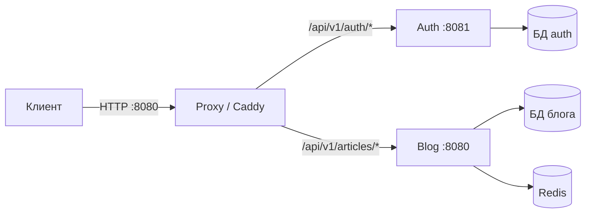
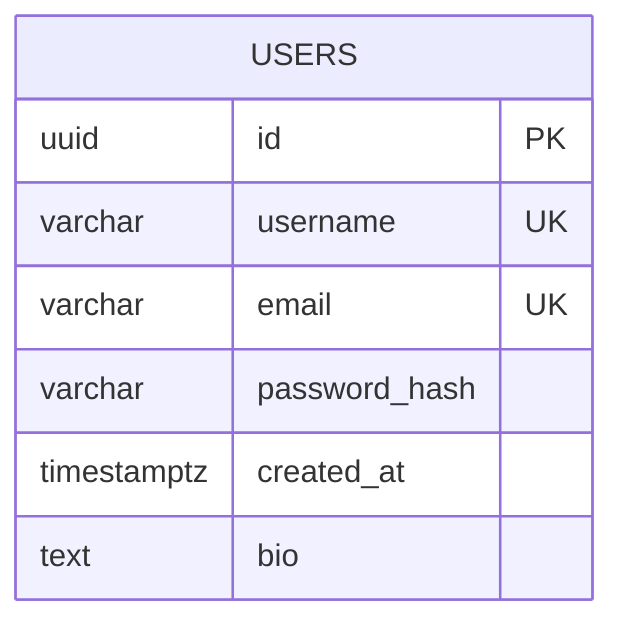
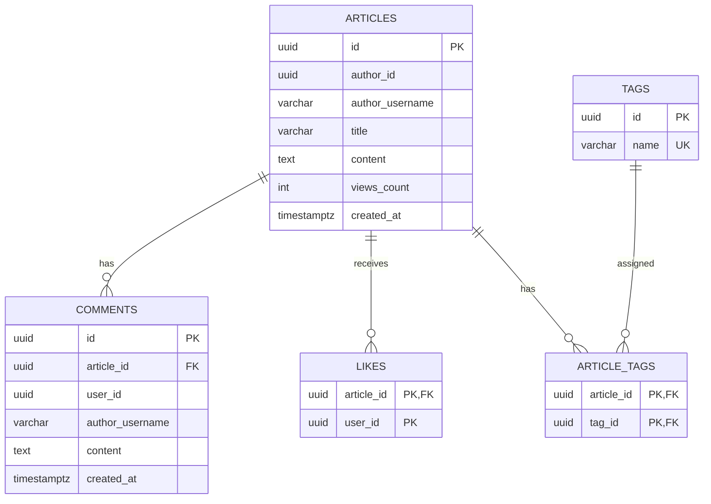

# Blog Backend

[](https://github.com/lya122221/Blog-Backend/actions/workflows/ci.yml)

REST API для IT-блога на Go. Auth-сервис отвечает за регистрацию, вход и выпуск
JWT. Блог-сервис хранит статьи, теги, комментарии и лайки, а просмотры считает
с помощью Redis. Публичные запросы проходят через reverse proxy.

## Возможности

- регистрация и вход по email и паролю в отдельном auth-сервисе;
- JWT-аутентификация: auth-сервис выдаёт EdDSA-токены, блог проверяет их локально;
- создание, чтение, обновление и удаление статей;
- проверка авторства при обновлении и удалении статьи;
- теги, фильтрация и пагинация;
- комментарии к статьям;
- установка и снятие лайка одним endpoint;
- буферизация просмотров в Redis и перенос в PostgreSQL фоновым worker;
- структурированные JSON или text логи с request ID;
- graceful shutdown HTTP-сервера и фонового worker;
- тесты, race detector, линтеры и контроль покрытия в GitHub Actions;
- публикация Docker-образов в GitHub Container Registry.

## Технологии

| Назначение | Технология |
|---|---|
| Язык | Go 1.27.0 |
| UUID | Стандартный пакет `uuid` |
| HTTP | Gin |
| Reverse proxy | Caddy 2 |
| База данных | PostgreSQL 15 |
| Драйвер PostgreSQL | pgx через `database/sql` |
| Кэш и просмотры | Redis 7 |
| Аутентификация | JWT EdDSA (Ed25519), bcrypt |
| Миграции | golang-migrate |
| Логирование | `log/slog` |
| Контейнеры | Docker и Docker Compose |
| CI/CD | GitHub Actions и GHCR |

## Архитектура

```text
Blog-Backend/
├── blog/                     # Самостоятельный Go-модуль основного API
│   ├── cmd/blog/             # Точка входа и graceful shutdown
│   ├── internal/handlers/    # HTTP-обработчики статей и взаимодействий
│   ├── internal/services/    # Логика блога
│   ├── internal/repositories/ # PostgreSQL и Redis
│   ├── internal/middleware/  # Локальная проверка JWT и логирование
│   ├── internal/workers/     # Перенос просмотров из Redis
│   ├── migrations/           # Миграции БД блога
│   ├── .env.example          # Образец настройки публичного ключа
│   ├── go.mod
│   └── Dockerfile
├── auth/                     # Самостоятельный Go-модуль auth-сервиса
│   ├── cmd/auth/             # Точка входа и graceful shutdown
│   ├── internal/handlers/    # Регистрация и вход
│   ├── internal/services/    # Работа с пользователями и паролями
│   ├── internal/repositories/ # PostgreSQL пользователей
│   ├── internal/tokens/      # Выпуск Ed25519 JWT
│   ├── migrations/           # Миграции БД auth-сервиса
│   ├── .env.example          # Образец настройки закрытого ключа
│   ├── go.mod
│   └── Dockerfile
├── proxy/                    # Публичный reverse proxy
│   ├── Caddyfile             # Правила маршрутизации
│   └── Dockerfile            # Образ Caddy
├── .github/workflows/ci.yml  # Проверки и публикация образов обоих сервисов
└── docker-compose.yml
```

Сервисы не импортируют пакеты друг друга. В каждом сервисе свои зависимости,
Dockerfile и миграции. Proxy направляет регистрацию и вход в auth-сервис,
остальные запросы — в блог. Пользователи хранятся только в базе auth-сервиса;
блог проверяет JWT по публичному ключу.


```mermaid
flowchart LR
    Client[Клиент] -->|HTTP :8080| Proxy[Proxy / Caddy]
    Proxy -->|/api/v1/auth/*| Auth[Auth :8081]
    Proxy -->|/api/v1/articles/*| Blog[Blog :8080]
    Auth --> AuthDB[(БД auth)]
    Blog --> BlogDB[(БД блога)]
    Blog --> Redis[(Redis)]
```

Auth выдаёт JWT клиенту через proxy. В защищённых запросах клиент передаёт его
в заголовке `Authorization` через тот же proxy. Блог проверяет подпись локально:
для каждого запроса обращаться к auth-сервису не требуется. Закрытый ключ
доступен только auth-сервису, соответствующий публичный ключ — блогу.

Зависимости направлены от HTTP-обработчиков к сервисам, а от сервисов — к
интерфейсам репозиториев. Благодаря этому сервисы и handlers тестируются без
запуска PostgreSQL и Redis.

### Проксирование через Caddy

Compose запускает отдельный контейнер `proxy` на базе `caddy:2-alpine`. Это
единственная публичная точка входа: порт `8080` контейнера опубликован на
порту `8080` хоста (при локальном запуске — `http://localhost:8080`). Caddy
обращается к сервисам по их именам и портам
внутри сети Compose, указанным в [`proxy/Caddyfile`](proxy/Caddyfile):

| Путь запроса | Куда направляет Caddy |
|---|---|
| `/api/v1/auth/*` | `auth:8081` — регистрация и вход |
| Все остальные пути | `api:8080` — API блога |

Блоки `handle` выбирают один маршрут для запроса; второй блок без условия служит
резервным маршрутом. Caddy сохраняет исходный путь и параметры запроса:
например, `/api/v1/auth/login` поступает в auth-сервис по тому же пути. Обычные
заголовки, включая `Authorization` и `X-Request-ID`, также передаются сервису.
Caddy не проверяет JWT: auth-сервис выдаёт токен, а middleware блога проверяет
его подпись на защищённых маршрутах. Подробнее о поведении Caddy:
[`handle`](https://caddyserver.com/docs/caddyfile/directives/handle) и
[`reverse_proxy`](https://caddyserver.com/docs/caddyfile/directives/reverse_proxy).

Текущий Caddyfile слушает HTTP на `:8080`; домен и TLS в нём не настроены.

### Подсчёт просмотров

При получении статьи счётчик увеличивается в Redis. Раз в три минуты worker
забирает накопленные значения и добавляет их к `articles.views_count` в
PostgreSQL. Это уменьшает количество записей в основную базу данных.

## Схема данных

### База auth-сервиса


```mermaid
erDiagram
    USERS {
        uuid id PK
        varchar username UK
        varchar email UK
        varchar password_hash
        timestamptz created_at
        text bio
    }
```

### База блога


```mermaid
erDiagram
    ARTICLES ||--o{ COMMENTS : has
    ARTICLES ||--o{ LIKES : receives
    ARTICLES ||--o{ ARTICLE_TAGS : has
    TAGS ||--o{ ARTICLE_TAGS : assigned

    ARTICLES {
        uuid id PK
        uuid author_id
        varchar author_username
        varchar title
        text content
        int views_count
        timestamptz created_at
    }
    TAGS {
        uuid id PK
        varchar name UK
    }
    ARTICLE_TAGS {
        uuid article_id PK, FK
        uuid tag_id PK, FK
    }
    COMMENTS {
        uuid id PK
        uuid article_id FK
        uuid user_id
        varchar author_username
        text content
        timestamptz created_at
    }
    LIKES {
        uuid article_id PK, FK
        uuid user_id PK
    }
```

Между базами нет внешних ключей. `articles.author_id`, `comments.user_id` и
`likes.user_id` содержат ID из проверенного JWT. Статьи и комментарии
дополнительно хранят имя автора на момент создания в `author_username`. При
чтении блог берёт его из самой записи; таблицы пользователей в базе блога нет.

### Миграции существующей базы

Миграции добавляются последовательно: ранние файлы описывают прежнюю схему,
а следующие меняют её. На чистой базе применяются все миграции, и итоговая
схема блога уже не содержит таблицу `users`.

Миграция `000007` сохраняет имена авторов существующих статей и комментариев
в самих записях и убирает внешние ключи на старую таблицу `users` блога.
Миграция `000008` заполняет оставшиеся пропуски и делает `author_username`
обязательным. Если имя автора нельзя восстановить, миграция завершится ошибкой
и не изменит схему. Миграция `000009` удаляет старую таблицу `users` только
если она пуста. При откате `000009` таблица создаётся снова пустой; откат к
схеме до `000007` после появления новых авторов потребует переноса их ID.
Пользователи из старой базы блога автоматически не переносятся в базу auth.

## Быстрый запуск

### Требования

- Docker;
- Docker Compose v2.

### 1. Клонирование

```bash
git clone https://github.com/lya122221/Blog-Backend.git
cd Blog-Backend
```

### 2. Конфигурация

Создайте `.env` в корне проекта:

```env
POSTGRES_USER=blog
POSTGRES_PASSWORD=change_me
POSTGRES_DB=blog
AUTH_POSTGRES_USER=auth
AUTH_POSTGRES_PASSWORD=change_me_too
AUTH_POSTGRES_DB=auth
LOG_LEVEL=info
LOG_FORMAT=json
```

Создайте `auth/.env` по образцу `auth/.env.example`. Сгенерируйте
`AUTH_JWT_PRIVATE_KEY` и запишите полученное значение в файл:

```bash
openssl rand -base64 32
```

Из того же seed вычислите публичный ключ для `blog/.env`:

```bash
printf 'BLOG_JWT_PUBLIC_KEY=%s\n' "$(
  { printf '\x30\x2e\x02\x01\x00\x30\x05\x06\x03\x2b\x65\x70\x04\x22\x04\x20';
    sed -n 's/^AUTH_JWT_PRIVATE_KEY=//p' auth/.env | base64 -d; } |
  openssl pkey -inform DER -pubout -outform DER |
  tail -c 32 | base64 -w0
)" > blog/.env
chmod 600 blog/.env
```

Префикс в команде представляет 32-байтный seed в формате PKCS#8, который
понимает OpenSSL. Создайте эту пару ключей один раз: при замене ключа ранее
выданные JWT перестанут проходить проверку. Файлы `.env` игнорируются Git и не
попадают в Docker-образы.

### 3. Запуск

```bash
docker compose up --build
```

Compose запустит две отдельные базы PostgreSQL, Redis, миграции обоих сервисов
и reverse proxy на `http://localhost:8080`. Proxy передаёт регистрацию и вход
в auth-сервис, а маршруты статей — в блог. Вход выдаёт Ed25519 JWT с `user_id`
и `username`; блог проверяет подпись по своему публичному ключу.
Порты API, auth-сервиса, PostgreSQL и Redis не публикуются на хосте.

На существующей базе блога миграция `000009` остановит запуск, если в старой
таблице `users` остались записи. Перед удалением этой таблицы их нужно
разобрать отдельно; миграция не переносит учётные записи между базами.

Посмотреть логи:

```bash
docker compose logs -f proxy api auth
```

Остановить приложение:

```bash
docker compose down --timeout 20
```

Таймаут в 20 секунд оставляет приложениям время на graceful shutdown. Данные
PostgreSQL сохраняются в отдельных volumes `postgres_data` и
`auth_postgres_data`.

## Переменные окружения

| Переменная | Обязательная | Значение по умолчанию | Описание |
|---|---:|---|---|
| `POSTGRES_USER` | да | — | Пользователь PostgreSQL |
| `POSTGRES_PASSWORD` | да | — | Пароль PostgreSQL |
| `POSTGRES_DB` | да | — | Имя базы данных |
| `POSTGRES_HOST` | нет | `localhost` | Хост PostgreSQL; в Compose используется `db` |
| `AUTH_POSTGRES_USER` | да | — | Пользователь PostgreSQL auth-сервиса |
| `AUTH_POSTGRES_PASSWORD` | да | — | Пароль PostgreSQL auth-сервиса |
| `AUTH_POSTGRES_DB` | да | — | Имя базы данных auth-сервиса |
| `AUTH_POSTGRES_HOST` | нет | `localhost` | Хост PostgreSQL auth-сервиса; в Compose используется `auth_db` |
| `AUTH_JWT_PRIVATE_KEY` | да, для auth-сервиса | — | Base64-кодированный 32-байтный seed Ed25519 в `auth/.env` |
| `BLOG_JWT_PUBLIC_KEY` | да, для блога | — | Base64-кодированный 32-байтный публичный ключ Ed25519 в `blog/.env` |
| `REDIS_HOST` | нет | `localhost` | Хост Redis; в Compose используется `redis` |
| `LOG_LEVEL` | нет | `info` | `debug`, `info`, `warn` или `error` |
| `LOG_FORMAT` | нет | `json` | `json` или `text` |

На хосте публикуется только порт `8080` публичного proxy. Внутри сети Compose
API слушает порт `8080`, auth-сервис — `8081`, обе базы PostgreSQL — `5432`,
Redis — `6379`.

Auth-сервис читает закрытый ключ из `auth/.env`, блог читает соответствующий
публичный ключ из `blog/.env`. Если ключи не совпадают, защищённые маршруты
возвращают `401`. Если `BLOG_JWT_PUBLIC_KEY` отсутствует или имеет неверный
формат, блог не запустится.

## API

Базовый URL:

```text
http://localhost:8080/api/v1
```

### Аутентификация

| Метод | Endpoint | Авторизация | Описание |
|---|---|---:|---|
| `POST` | `/auth/register` | нет | Регистрация пользователя |
| `POST` | `/auth/login` | нет | Получение JWT |

Регистрация:

```bash
curl -X POST http://localhost:8080/api/v1/auth/register \
  -H "Content-Type: application/json" \
  -d '{
    "email": "user@example.com",
    "username": "user",
    "password": "secret123"
  }'
```

Вход:

```bash
curl -X POST http://localhost:8080/api/v1/auth/login \
  -H "Content-Type: application/json" \
  -d '{
    "email": "user@example.com",
    "password": "secret123"
  }'
```

Успешный вход возвращает:

```json
{
  "token": "<JWT>"
}
```

JWT действует 24 часа.

При регистрации auth-сервис возвращает `201` и `null`; повторный email или
username — `409`. Успешный вход возвращает `200` с JWT, неверные учётные данные
— `401`. Токен содержит `user_id` и `username`; блог также проверяет срок
действия, издателя `blog-auth` и аудиторию `blog`.

Для защищённых endpoint передавайте токен:

```http
Authorization: Bearer <JWT>
```

### Статьи

| Метод | Endpoint | Авторизация | Описание |
|---|---|---:|---|
| `GET` | `/articles/` | нет | Список статей |
| `GET` | `/articles/:id` | нет | Статья по UUID |
| `POST` | `/articles/` | да | Создание статьи |
| `PUT` | `/articles/:id` | да, автор | Полное обновление статьи |
| `DELETE` | `/articles/:id` | да, автор | Удаление статьи |

Параметры `GET /articles/`:

| Параметр | По умолчанию | Описание |
|---|---:|---|
| `page` | `1` | Номер страницы, начиная с 1 |
| `limit` | `20` | Размер страницы от 1 до 99 |
| `tag` | — | Повторяемый фильтр: статья подходит при совпадении любого указанного тега |

Пример фильтрации:

```bash
curl "http://localhost:8080/api/v1/articles/?page=1&limit=10&tag=go&tag=docker"
```

Создание статьи:

```bash
curl -X POST http://localhost:8080/api/v1/articles/ \
  -H "Content-Type: application/json" \
  -H "Authorization: Bearer <JWT>" \
  -d '{
    "title": "Начало работы с Go",
    "content": "Содержимое статьи",
    "tags": ["go", "tutorial"]
  }'
```

ID и имя автора берутся из JWT. Поле `author` в теле запроса не требуется и не
может подменить автора статьи.

Обновление статьи:

```bash
curl -X PUT http://localhost:8080/api/v1/articles/<ARTICLE_UUID> \
  -H "Content-Type: application/json" \
  -H "Authorization: Bearer <JWT>" \
  -d '{
    "title": "Обновлённый заголовок",
    "content": "Обновлённое содержимое",
    "tags": ["go", "backend"]
  }'
```

### Комментарии и лайки

| Метод | Endpoint | Авторизация | Описание |
|---|---|---:|---|
| `GET` | `/articles/:id/comments` | нет | Комментарии статьи |
| `POST` | `/articles/:id/comments` | да | Создание комментария |
| `POST` | `/articles/:id/like` | да | Установка или снятие лайка |

Создание комментария:

```bash
curl -X POST http://localhost:8080/api/v1/articles/<ARTICLE_UUID>/comments \
  -H "Content-Type: application/json" \
  -H "Authorization: Bearer <JWT>" \
  -d '{"content":"Полезная статья!"}'
```

Переключение лайка:

```bash
curl -X POST http://localhost:8080/api/v1/articles/<ARTICLE_UUID>/like \
  -H "Authorization: Bearer <JWT>"
```

Ответ:

```json
{
  "liked": true,
  "likes_count": 1
}
```

## Логирование

Оба Go-сервиса по умолчанию пишут структурированные JSON-логи в stdout. Для
локальной разработки можно установить `LOG_FORMAT=text`.

Ответы Go-сервисов содержат заголовок `X-Request-ID`. Клиент может передать
собственный идентификатор в запросе; если его нет, сервис создаст UUID.

Пример access log:

```json
{
  "level": "INFO",
  "msg": "http request",
  "request_id": "26758086-8930-4188-b774-75f72d34b78f",
  "method": "GET",
  "path": "/api/v1/articles/:id",
  "status": 200,
  "duration_ms": 3,
  "client_ip": "172.18.0.1",
  "response_size": 428
}
```

JWT, пароли и тела запросов не логируются. Ответы `4xx` записываются на уровне
`WARN`, ответы `5xx` — на уровне `ERROR`. Panic перехватывается recovery
middleware, логируется со stack trace и возвращает HTTP 500.

## Graceful shutdown

Оба сервиса обрабатывают `SIGINT` и `SIGTERM`: прекращают принимать новые
HTTP-запросы и до 10 секунд ожидают активные. Затем auth закрывает подключение
к своей базе PostgreSQL. Блог дополнительно останавливает фоновый worker
(ожидание до 5 секунд) и закрывает подключения к Redis и своей базе PostgreSQL.

В обоих сервисах Gin работает внутри стандартного `http.Server`.

## Разработка и проверки

Для тестов и сборки нужен Go 1.27.0. При запуске без Compose auth-сервису
нужна отдельная база PostgreSQL, блогу — своя база PostgreSQL и Redis.

Если базы и Redis доступны локально, настройте переменные окружения из таблицы
выше и запустите каждый сервис из его папки. `auth/.env` и `blog/.env` содержат
ключи JWT, а переменные подключения к базам можно экспортировать в окружение.
Compose не публикует порты баз и Redis на хосте.

В первом терминале из корня проекта:

```bash
cd auth
go run ./cmd/auth
```

Во втором терминале из корня проекта:

```bash
cd blog
go run ./cmd/blog
```

Команды Go выполняются внутри папки нужного сервиса (`blog` или `auth`).
Например, для блога:

```bash
go test ./...
```

Проверить гонки данных:

```bash
go test -race ./...
```

Сформировать отчёт о покрытии:

```bash
go test ./... -covermode=atomic -coverprofile=coverage.out
go tool cover -func=coverage.out
go tool cover -html=coverage.out
```

CI проверяет покрытие каждого сервиса отдельно; минимальный порог — 70%.

Запустить статический анализ:

```bash
go vet ./...
golangci-lint run
```

В каждом сервисе своя `.golangci.yml`; CI использует версию `v2.13.2`.

## CI и публикация Docker-образов

Workflow `.github/workflows/ci.yml` запускается:

- при push в `main`;
- для pull request в `main`;
- при push Git-тега вида `v*`;
- вручную через `workflow_dispatch`.

Для каждого сервиса jobs `Lint` и `Test and build` проверяют форматирование,
линтеры, race detector, покрытие, сборку приложения и Dockerfile.

После успешных проверок push в `main` публикует два образа:

```text
ghcr.io/lya122221/blog-backend:latest
ghcr.io/lya122221/blog-backend:sha-<COMMIT_SHA>
ghcr.io/lya122221/blog-backend-auth:latest
ghcr.io/lya122221/blog-backend-auth:sha-<COMMIT_SHA>
```

Git-тег создаёт версионные Docker-теги:

```bash
git tag v1.0.0
git push origin v1.0.0
```

```text
ghcr.io/lya122221/blog-backend:1.0.0
ghcr.io/lya122221/blog-backend:1.0
ghcr.io/lya122221/blog-backend-auth:1.0.0
ghcr.io/lya122221/blog-backend-auth:1.0
```

Скачать опубликованный образ:

```bash
docker pull ghcr.io/lya122221/blog-backend:latest
```

Workflow создаёт provenance-attestation для каждого опубликованного образа.
Автоматическое развёртывание на production-сервер пока не настроено.
