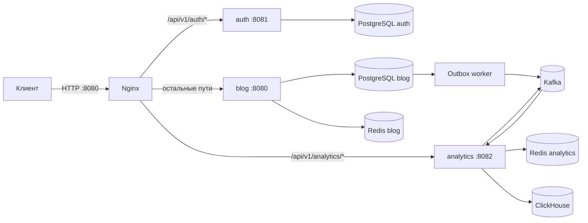

# Blog Backend

Backend IT-блога на Go. В проекте три приложения: **auth** регистрирует пользователей и выдаёт JWT, **blog** хранит статьи и действия пользователей, **analytics** считает популярность и статистику. Единственная публичная точка входа — Nginx на `http://localhost:8080`.

## Возможности

- Регистрация и вход по email и паролю; JWT подписываются Ed25519.
- Статьи с тегами, фильтрацией и пагинацией; комментарии и переключение лайка.
- Проверка авторства при изменении и удалении статьи.
- Счётчик просмотров блога через Redis с периодической записью в PostgreSQL.
- События показов, открытий, лайков, комментариев и изменений статей через Kafka.
- Transactional outbox для действий блога, пакетный consumer и DLQ для некорректных событий.
- Популярные статьи за 5 минут, час и день; статистика автора за 7, 30 и 90 дней.
- Тесты, линтеры, race detector и контроль покрытия в CI.

## Технологии и структура

| Компонент | Технология |
|---|---|
| HTTP-сервисы | Go 1.27.0, Gin |
| Публичный reverse proxy | Nginx |
| Данные auth и блога | Отдельные PostgreSQL 15 |
| Счётчик просмотров и ограничение повторов | Отдельные Redis 7 |
| Доставка событий | Apache Kafka |
| События и агрегаты аналитики | ClickHouse |
| Аутентификация | JWT EdDSA (Ed25519), bcrypt |
| Миграции | golang-migrate |
| Логи | log/slog |
| Запуск | Docker Compose |

| Путь | Назначение |
|---|---|
| `auth/` | Пользователи, пароли и выпуск JWT |
| `blog/` | Статьи, комментарии, лайки, outbox и счётчик просмотров |
| `analytics/` | Приём событий просмотров, Kafka consumer, ClickHouse и статистика |
| `proxy/` | Образ Nginx и правила маршрутизации |
| `docker-compose.yml` | Приложения, хранилища и миграции |
| `.github/workflows/ci.yml` | Проверки и публикация образов |

Сервисы имеют отдельные Go-модули, Dockerfile и миграции. Внутри Go-приложений HTTP-обработчики обращаются к сервисному слою, а сервисы — к интерфейсам хранилищ и производителей событий.

## Архитектура


```mermaid
flowchart LR
    Client[Клиент] -->|HTTP :8080| Nginx[Nginx]
    Nginx -->|/api/v1/auth/*| Auth[auth :8081]
    Nginx -->|/api/v1/analytics/*| Analytics[analytics :8082]
    Nginx -->|остальные пути| Blog[blog :8080]
    Auth --> AuthDB[(PostgreSQL auth)]
    Blog --> BlogDB[(PostgreSQL blog)]
    Blog --> BlogRedis[(Redis blog)]
    BlogDB --> Outbox[Outbox worker]
    Outbox --> Kafka[(Kafka)]
    Analytics --> Kafka
    Kafka --> Analytics
    Analytics --> AnalyticsRedis[(Redis analytics)]
    Analytics --> ClickHouse[(ClickHouse)]
```

Nginx слушает порт `8080`, оставляет URI запроса неизменным и передаёт стандартные заголовки, в том числе `Authorization` и `X-Request-ID`. Правила находятся в [proxy/nginx.conf](proxy/nginx.conf): `/api/v1/auth/` идёт в auth, `/api/v1/analytics/` — в analytics, всё остальное — в blog. Nginx не проверяет JWT: защищённые маршруты blog и analytics проверяют подпись локально по одному публичному ключу. В конфигурации Compose используется HTTP без TLS.

### Как проходят события

1. Создание, обновление и удаление статьи, комментарий или переключение лайка сохраняются в PostgreSQL блога вместе с записью в `outbox_events` в **одной транзакции**.
2. Outbox worker публикует запись в Kafka и только после подтверждения брокера отмечает её отправленной. Ключ сообщения — ID статьи, поэтому события одной статьи попадают в одну партицию.
3. Analytics читает Kafka пачками, проверяет события, рассчитывает баллы и записывает их в ClickHouse. Смещения Kafka фиксируются после записи. Ошибки обрабатываются повторными попытками; события, которые нельзя обработать, отправляются в отдельный topic DLQ с причиной.
4. Показы и открытия поступают отдельным HTTP-запросом `POST /api/v1/analytics/views` через Nginx. Ответ `202` означает публикацию в Kafka; обновление статистики происходит асинхронно.

Отправка и обработка имеют семантику *at least once*. Повторная доставка с тем же `event_id` учитывается в агрегатах один раз. При временной недоступности Kafka или ClickHouse обработка возобновляется без потери незафиксированных сообщений.

| Событие | Балл |
|---|---:|
| `article.impression` — показ карточки | +1 |
| `article.opened` — открытие статьи | +3 |
| `article.liked` — лайк | +6 |
| `article.unliked` — снятие лайка | −6 |
| `comment.created` — комментарий | +6 |
| `article.created`, `article.updated`, `article.deleted` | 0 |

Для одного посетителя и статьи каждый вид просмотра учитывается не чаще одного раза за 30 минут. Analytics хранит анонимный ID посетителя в cookie `analytics_visitor`; отдельный Redis используется для ограничения повторов. Клиент должен отправлять показ при появлении карточки в видимой области и открытие при переходе к статье. Открытие не зависит от времени чтения. Оба запроса проходят через Nginx, а изменения статьи и действия авторизованных пользователей идут в blog.

Существующий `views_count` в PostgreSQL блога считается отдельно: blog складывает обращения к статье в Redis, а фоновый worker раз в три минуты переносит их в PostgreSQL. Этот счётчик не равен количеству событий `article.opened` в аналитике.

### Данные ClickHouse

| Таблица | Назначение | Срок хранения |
|---|---|---|
| `article_events` | Исходные события и их `occurred_at` | 30 дней |
| `article_stats_minute` | Агрегаты для рейтинга | 2 дня |
| `article_stats_hour` | Почасовой график автора | 8 дней |
| `article_stats_day` | Дневной график автора | 91 день |
| `article_state` | Текущий автор, заголовок, теги и признак удаления | Без TTL |

Агрегаты содержат уникальные `event_id` по статье, типу события и интервалу. Популярность считается по исходному времени события в скользящих окнах 5 минут, 1 час и 1 день. Для неполных минут запрос использует исходные события, для полных — минутные агрегаты. Ответ содержит текущие заголовок и теги; удалённая статья исключается из рейтинга.

Статистика автора включает показы, открытия, лайки, снятия лайков, комментарии и суммарный балл. Период `7d` содержит 168 часовых интервалов, `30d` и `90d` — 30 и 90 дневных интервалов. Границы выровнены по UTC; текущий неполный интервал считается по исходным событиям. Пустые интервалы возвращаются с нулями. Удалённые статьи исключаются из общей статистики, а запрос статистики удалённой или чужой статьи возвращает `404`. Статистики «за всё время» нет.

### Данные PostgreSQL

Auth хранит пользователей в отдельной базе. Блог хранит статьи, теги, комментарии, лайки и outbox; ID пользователей приходят из проверенного JWT. Между базами auth и blog внешних ключей нет. Имя автора статьи или комментария сохраняется в записи на момент создания.

На существующей базе блога миграции `000007`–`000009` отсоединяют авторов от прежней таблицы `users` и затем удаляют её. `000008` останавливается, если имя автора не удалось восстановить; `000009` требует пустую старую таблицу `users`. Старые учётные записи автоматически не переносятся в auth.

## Быстрый запуск

Нужны Docker и Docker Compose v2.

```bash
git clone https://github.com/lya122221/Blog-Backend.git
cd Blog-Backend
```

Создайте корневой `.env` для двух PostgreSQL:

```env
POSTGRES_USER=blog
POSTGRES_PASSWORD=change_me
POSTGRES_DB=blog
AUTH_POSTGRES_USER=auth
AUTH_POSTGRES_PASSWORD=change_me_too
AUTH_POSTGRES_DB=auth
LOG_LEVEL=info
LOG_FORMAT=json
```

Создайте ключ подписи JWT и публичные ключи для blog и analytics:

```bash
printf 'AUTH_JWT_PRIVATE_KEY=%s\n' "$(openssl rand -base64 32)" > auth/.env

public_key="$(
  { printf '\x30\x2e\x02\x01\x00\x30\x05\x06\x03\x2b\x65\x70\x04\x22\x04\x20';
    sed -n 's/^AUTH_JWT_PRIVATE_KEY=//p' auth/.env | base64 -d; } |
  openssl pkey -inform DER -pubout -outform DER |
  tail -c 32 | base64 -w0
)"
printf 'BLOG_JWT_PUBLIC_KEY=%s\n' "$public_key" > blog/.env
sed "s|^ANALYTICS_JWT_PUBLIC_KEY=.*|ANALYTICS_JWT_PUBLIC_KEY=$public_key|" \
  analytics/.env.example > analytics/.env
chmod 600 auth/.env blog/.env analytics/.env
```

Для локальной разработки значения остальных переменных берите из `blog/.env.example` и `analytics/.env.example`. При запуске в Compose адреса Kafka, ClickHouse и Redis подставляются из `docker-compose.yml`. Файлы `.env` исключены из Git. Если заменить ключ, уже выданные JWT перестанут проходить проверку.

Запустите проект:

```bash
docker compose up --build
```

После запуска API доступен по `http://localhost:8080/api/v1`. Только порт Nginx `8080` опубликован на хосте. Приложения, базы, Redis, Kafka и ClickHouse работают внутри сети Compose. Создаются три Kafka-партиции для topic событий и три для DLQ; это одна локальная Kafka-инстанция с коэффициентом репликации 1.

```bash
docker compose logs -f proxy api auth analytics kafka clickhouse
docker compose down --timeout 20
```

`down` сохраняет данные в Docker volumes. Таймаут при остановке даёт приложениям время завершить запросы и записать неполную пачку событий.

## API

Базовый URL: `http://localhost:8080/api/v1`. Все примеры идут через Nginx.

### Аутентификация

| Метод | Путь | Доступ | Назначение |
|---|---|---|---|
| `POST` | `/auth/register` | Публичный | Регистрация |
| `POST` | `/auth/login` | Публичный | Получение JWT |

```bash
curl -X POST http://localhost:8080/api/v1/auth/register \
  -H 'Content-Type: application/json' \
  -d '{"email":"user@example.com","username":"user","password":"secret123"}'

curl -X POST http://localhost:8080/api/v1/auth/login \
  -H 'Content-Type: application/json' \
  -d '{"email":"user@example.com","password":"secret123"}'
```

Вход возвращает `{"token":"<JWT>"}`. JWT действует 24 часа. Защищённые запросы передают `Authorization: Bearer <JWT>`. Blog и analytics проверяют срок действия, подпись, издателя `blog-auth`, аудиторию `blog` и ID пользователя. Неверные учётные данные при входе дают `401`; повторный email или username при регистрации — `409`.

### Статьи

| Метод | Путь | Доступ | Назначение |
|---|---|---|---|
| `GET` | `/articles/` | Публичный | Лента статей |
| `GET` | `/articles/:id` | Публичный | Статья по UUID |
| `POST` | `/articles/` | JWT | Создать статью |
| `PUT` | `/articles/:id` | Автор | Обновить статью |
| `DELETE` | `/articles/:id` | Автор | Удалить статью |
| `GET` | `/articles/:id/comments` | Публичный | Комментарии |
| `POST` | `/articles/:id/comments` | JWT | Добавить комментарий |
| `POST` | `/articles/:id/like` | JWT | Поставить или снять лайк |

У `GET /articles/` есть `page` (по умолчанию 1), `limit` (по умолчанию 20, допустимо 1–99) и повторяемый `tag`. При нескольких тегах статья подходит по любому из них:

```bash
curl 'http://localhost:8080/api/v1/articles/?page=1&limit=10&tag=go&tag=docker'
```

Создание статьи:

```bash
curl -X POST http://localhost:8080/api/v1/articles/ \
  -H 'Content-Type: application/json' \
  -H 'Authorization: Bearer <JWT>' \
  -d '{"title":"Начало работы с Go","content":"Содержимое статьи","tags":["go","tutorial"]}'
```

Автор берётся из JWT. Обновление использует `PUT` с полями `title`, `content` и `tags`. Комментарий создаётся с телом `{"content":"Полезная статья!"}`. Запрос `POST /articles/:id/like` без тела переключает лайк и возвращает `liked` и `likes_count`. Чтение статьи увеличивает отдельный `views_count` блога.

### Аналитика

| Метод | Путь | Доступ | Назначение |
|---|---|---|---|
| `POST` | `/analytics/views` | Публичный | Пачка показов и открытий |
| `GET` | `/analytics/popular?window=5m` | Публичный | Рейтинг за `5m`, `1h` или `1d` |
| `GET` | `/analytics/me/stats?period=7d` | JWT | Общая статистика своих статей |
| `GET` | `/analytics/me/articles/:id/stats?period=7d` | Автор | Статистика одной своей статьи |

`POST /analytics/views` принимает от 1 до 100 событий, каждое с UUID, типом `article.impression` или `article.opened`, UUID статьи и временем в UTC. Тело ограничено 64 КиБ. Отправляйте время события не старше 30 дней и не позже двух минут в будущем. Для показа и открытия одной статьи клиент делает два отдельных запроса через тот же Nginx. Повторяя запрос после `503`, сохраняйте исходные `event_id` и cookie:

```bash
event_id="$(cat /proc/sys/kernel/random/uuid)"
occurred_at="$(date -u +%Y-%m-%dT%H:%M:%SZ)"
curl -X POST http://localhost:8080/api/v1/analytics/views \
  -H 'Content-Type: application/json' \
  -c cookies.txt -b cookies.txt \
  -d "{\"events\":[{\"event_id\":\"$event_id\",\"type\":\"article.opened\",\"article_id\":\"<ARTICLE_UUID>\",\"occurred_at\":\"$occurred_at\"}]}"
```

Ответ — `202 {"accepted":1}`; для повторов в 30-минутном окне `accepted` может быть 0. Некорректный запрос получает `400`, ошибка публикации в Kafka — `503` с `Retry-After`.

Рейтинг запрашивается так:

```bash
curl 'http://localhost:8080/api/v1/analytics/popular?window=1h&limit=10'
```

`window` обязателен, `limit` по умолчанию 10 и может быть от 1 до 100. Ответ содержит `window` и отсортированный по убыванию балла массив `articles`; у каждой статьи есть `article_id`, `title`, `tags` и `score`.

Статистику автора запрашивайте с JWT:

```bash
curl 'http://localhost:8080/api/v1/analytics/me/stats?period=7d' \
  -H 'Authorization: Bearer <JWT>'

curl 'http://localhost:8080/api/v1/analytics/me/articles/<ARTICLE_UUID>/stats?period=30d' \
  -H 'Authorization: Bearer <JWT>'
```

`period` обязателен: `7d`, `30d` или `90d`. Ответ содержит `period`, границы `from` и `to`, общие счётчики `totals` и массив `series` с точками `start`, `impressions`, `opens`, `likes`, `unlikes`, `comments`, `score`. Ответ по одной статье дополнительно содержит `article_id`, `title`, `tags`. Для чужой, удалённой или несуществующей статьи возвращается `404`, для неверного JWT — `401`.

## Настройки

Корневой `.env` содержит параметры двух PostgreSQL и общие `LOG_LEVEL`/`LOG_FORMAT`. Ключи JWT лежат в `auth/.env`, `blog/.env` и `analytics/.env`.

| Переменная | Сервис | Значение |
|---|---|---|
| `POSTGRES_USER`, `POSTGRES_PASSWORD`, `POSTGRES_DB` | blog | База блога |
| `AUTH_POSTGRES_USER`, `AUTH_POSTGRES_PASSWORD`, `AUTH_POSTGRES_DB` | auth | База пользователей |
| `AUTH_JWT_PRIVATE_KEY` | auth | Base64 seed Ed25519, 32 байта |
| `BLOG_JWT_PUBLIC_KEY` | blog | Base64 публичный ключ Ed25519, 32 байта |
| `ANALYTICS_JWT_PUBLIC_KEY` | analytics | Тот же публичный ключ |
| `BLOG_KAFKA_BROKERS`, `BLOG_KAFKA_TOPIC` | blog | Брокеры и topic outbox |
| `BLOG_OUTBOX_BATCH_SIZE` | blog | Размер пачки, по умолчанию 100 |
| `BLOG_OUTBOX_POLL_INTERVAL` | blog | Интервал опроса, по умолчанию 1s |
| `BLOG_OUTBOX_RETRY_INTERVAL` | blog | Пауза после ошибки, по умолчанию 2s |
| `BLOG_OUTBOX_CLEANUP_INTERVAL` | blog | Интервал очистки, по умолчанию 1h |
| `BLOG_OUTBOX_RETENTION` | blog | Хранение опубликованного outbox, по умолчанию 7d |
| `ANALYTICS_PORT` | analytics | HTTP-порт, в Compose 8082 |
| `ANALYTICS_KAFKA_BROKERS`, `ANALYTICS_KAFKA_TOPIC` | analytics | Брокеры и topic событий |
| `ANALYTICS_KAFKA_DLQ_TOPIC`, `ANALYTICS_KAFKA_CONSUMER_GROUP` | analytics | Topic ошибок и consumer group |
| `ANALYTICS_KAFKA_BATCH_SIZE` | analytics | Пачка consumer, в образце 500 |
| `ANALYTICS_KAFKA_FLUSH_INTERVAL` | analytics | Ожидание неполной пачки, в образце 1s |
| `ANALYTICS_RETRY_ATTEMPTS`, `ANALYTICS_RETRY_BACKOFF` | analytics | Повторы при ошибках, в образце 3 и 100ms |
| `ANALYTICS_REDIS_ADDR` | analytics | Адрес Redis ограничителя |
| `ANALYTICS_CLICKHOUSE_ADDR`, `ANALYTICS_CLICKHOUSE_DATABASE`, `ANALYTICS_CLICKHOUSE_USER`, `ANALYTICS_CLICKHOUSE_PASSWORD` | analytics | Подключение к ClickHouse |
| `ANALYTICS_COOKIE_SECURE` | analytics | Атрибут Secure; по умолчанию false |
| `LOG_LEVEL`, `LOG_FORMAT` | все Go-сервисы | Уровень логов и формат `json`/`text` |

Compose задаёт внутренние адреса хранилищ. При отдельном запуске сервисов нужны доступные PostgreSQL, Redis, Kafka и ClickHouse; полные образцы переменных находятся в `.env.example` каждого сервиса. Nginx, blog, auth и analytics ожидают имена сервисов и порты из Compose.

## Проверки и CI

Команды выполняются из папки нужного Go-модуля (`auth`, `blog` или `analytics`):

```bash
go test ./...
go test -race ./...
go vet ./...
golangci-lint run
go test ./... -covermode=atomic -coverprofile=coverage.out
go tool cover -func=coverage.out
```

Репозиторий содержит интеграционные тесты с внешними хранилищами. Они пропускаются, если соответствующие тестовые адреса не заданы. `analytics` проверяется в CI вместе с `auth` и `blog`: форматирование, golangci-lint, vet, race detector, покрытие не ниже 70%, Go-сборка и Docker-сборка.

При push в `main` workflow публикует в GHCR образы **blog** и **auth** с тегами `latest` и `sha-<COMMIT_SHA>`. Тег Git вида `v1.0.0` создаёт версионные теги `1.0.0` и `1.0`. Образ analytics сейчас собирается и тестируется в CI, но не публикуется этим workflow. Docker Compose собирает его локально из `analytics/Dockerfile`.

## Логи и остановка

Go-сервисы пишут структурированные логи в stdout и добавляют `X-Request-ID` в ответ. Если клиент передал этот заголовок, он используется в логе; иначе создаётся UUID. Тела запросов, пароли и JWT не логируются. Ответы `4xx` логируются на уровне WARN, `5xx` — ERROR. Nginx пишет собственные access и error логи в контейнер.

При `SIGINT`/`SIGTERM` HTTP-серверы завершают активные запросы, blog останавливает фоновые worker, analytics записывает неполную пачку в ClickHouse и фиксирует обработанные смещения Kafka. Если запись не удалась, смещения остаются незафиксированными для повторной обработки.
